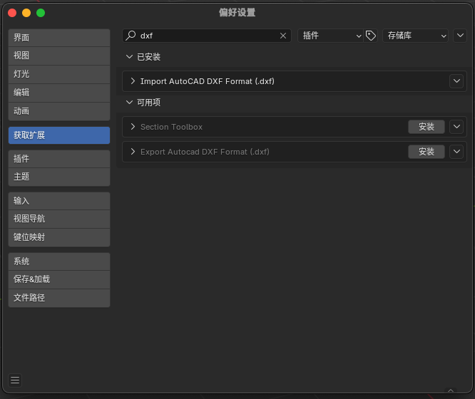

# Blender 安装插件

在Blender中安装插件时，需要将文件夹打包为ZIP压缩文件才可以在Blender中从磁盘安装此插件。

因此需要运行此命令：
```bash
zip -r lehuyeplugin.zip .
```

此时在当前文件夹下会生成一个lehuyeplugin.zip压缩包，只需要在Blender中【编辑】【偏好设置】【插件】，【从磁盘导入】
选择该压缩包即可安装该插件。

# 文件结构

# 需要安装 Import curve dxf plugin




# ultrs 文件夹 

函数统一放在 这个是处理的根本逻辑，每个功能独立为一个py文件，需要将其引入_init_.py文件

# ui_panel.py 主要是用来

创建UI面板，需要在 main.py 文件中引入对应的功能 再从 ui_panel.py 去构建界面